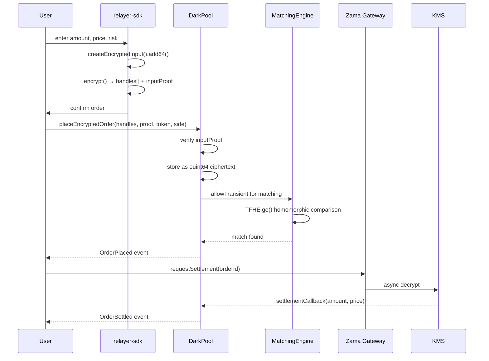
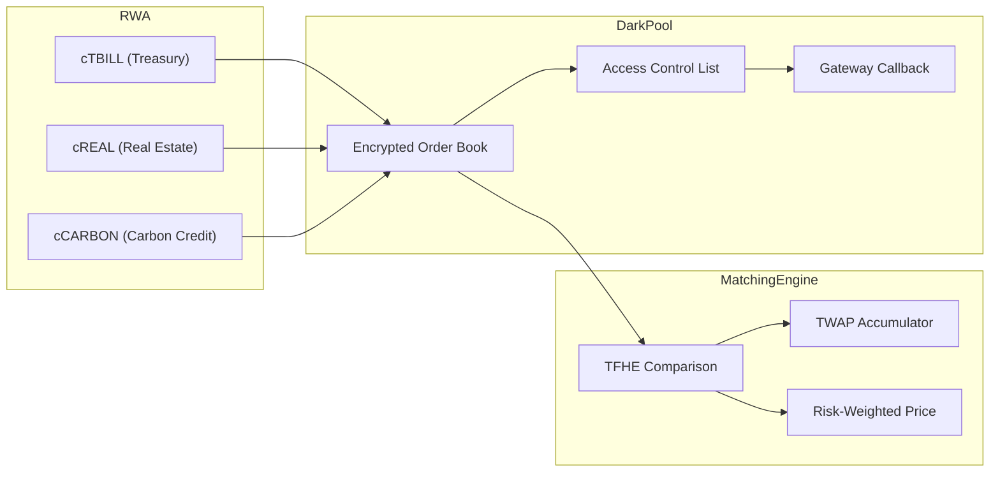

# CipherRWA Architecture

## System Overview

```mermaid
flowchart TB
    subgraph Client["Client Layer (Next.js)"]
        UI[Dashboard UI]
        SDK["@zama-fhe/relayer-sdk"]
        Wallet[Wagmi + MetaMask]
    end

    subgraph Contracts["Smart Contracts (Sepolia)"]
        DP[DarkPool.sol]
        ME[MatchingEngine.sol]
        RWA[RWA.sol]
        PO[RWAPriceOracle.sol]
    end

    subgraph FHE["FHE Infrastructure"]
        Relayer[Zama Relayer]
        Gateway[Zama Gateway]
        KMS[KMS Decryption]
    end

    UI -->|encrypt values| SDK
    SDK -->|handles[] + inputProof| Wallet
    Wallet -->|placeEncryptedOrder| DP
    DP -->|FHE comparison| ME
    DP -->|mint/transfer| RWA
    DP -->|read prices| PO
    DP -->|requestDecryption| Gateway
    Gateway -->|decrypt| KMS
    SDK -->|verify| Relayer
```

## Order Flow



## Contract Architecture



## FHE Data Types

| Field | Type | SDK Method | Purpose |
|-------|------|-----------|---------|
| Order Amount | `euint64` | `add64()` | Encrypted trade size |
| Order Price | `euint64` | `add64()` | Fixed-point encrypted price |
| Risk Score | `euint64` | `add64()` | Investor accreditation (0-100) |
| Trader Address | `eaddress` | `addAddress()` | Encrypted counterparty identity |
| Compliance Flag | `ebool` | `addBool()` | Accredited investor status |

## Security Model

- **Zero Plaintext**: No order parameter is ever exposed on-chain in readable form
- **ACL-Gated Decrypt**: Only order owner can request decryption via Zama Gateway
- **Transient Permissions**: Matching engine receives temporary access for homomorphic comparison
- **Input Proof Verification**: All encrypted inputs are verified via EIP-712 ZK proofs
- **Async Settlement**: Gateway decrypt occurs off-chain, results returned via callback
